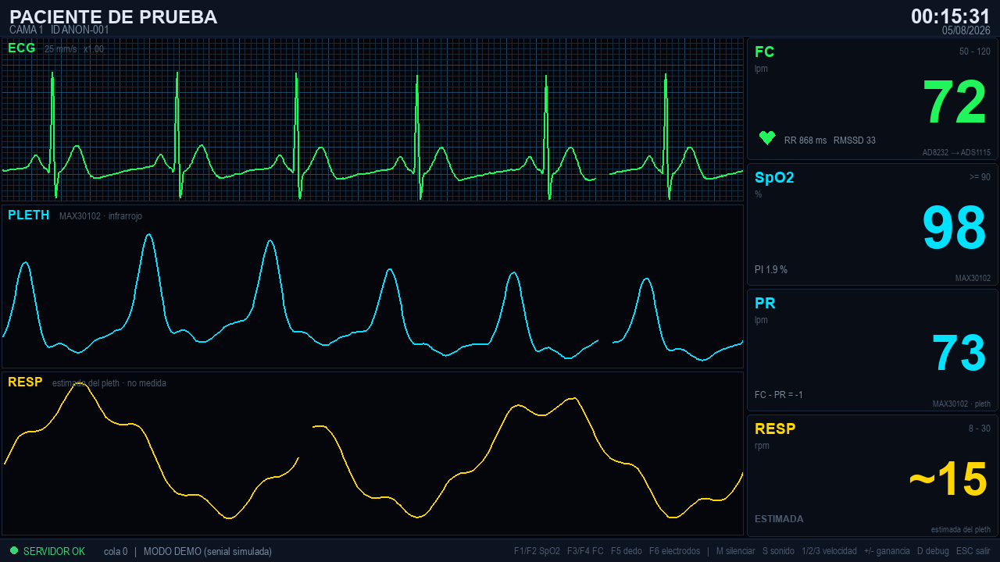
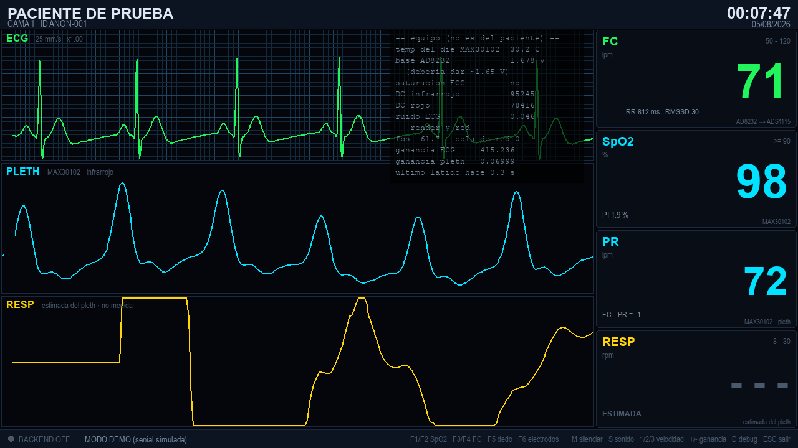

# Monitor de signos vitales — Raspberry Pi

Monitor de cabecera hecho con **MAX30102** (SpO2 y pulso), **AD8232** (ECG) y
**ADS1115** (conversor A/D). Hace dos cosas:

1. **Muestra** en la pantalla del Pi un monitor de paciente a pantalla completa:
   ECG con papel milimetrado, pletismografia, respiracion, numeros grandes y
   alarmas.
2. **Manda** todo en JSON por HTTP a un backend en la misma red WiFi.

En pantalla **solo aparece lo que estos tres modulos pueden medir**. Cada caja
del panel numerico lleva escrito de que sensor sale, y lo que es una estimacion
esta rotulado como tal.




Panel de diagnostico (tecla `D`): la salud del **equipo**, separada de los
signos vitales del paciente.



> ⚠️ **Esto no es un equipo medico.** No esta certificado ni calibrado contra
> ningun patron. La curva de SpO2 es una aproximacion generica y la deteccion
> de QRS no es de grado diagnostico. Sirve para aprender, prototipar y ver
> tendencias. No lo uses para diagnosticar ni para decidir nada sobre la salud
> de una persona.

---

## Que mide cada modulo (y que no)

| Modulo | Que mide de verdad | Lo que sale en pantalla |
|---|---|---|
| **AD8232** | un canal de ECG analogico + LO+/LO- de electrodo suelto | traza de ECG, **FC**, intervalo R-R, RMSSD de corto plazo |
| **ADS1115** | nada propio: es el conversor A/D del AD8232 | digitaliza el ECG y avisa si la senial satura |
| **MAX30102** | luz roja e infrarroja reflejada, y la temperatura de su propio chip | pletismografia, **SpO2**, **PR**, **indice de perfusion** |

**Lo que este equipo no mide**, y por eso no aparece como signo vital:
temperatura corporal, presion arterial, capnografia, y respiracion por
impedancia toracica o por flujo.

Dos casos de frontera, marcados en la pantalla en vez de disimulados:

- **RESP** sale de como la respiracion mueve la linea de base del
  pletismografo. Es una tecnica real, pero es una **estimacion**: el numero va
  con un `~` adelante y la caja dice ESTIMADA. Si preferis no mostrarlo,
  `resp.enabled: false` en la configuracion lo saca junto con su carril.
- **La temperatura del MAX30102** es la de su propio chip, que el fabricante
  expone para compensar la deriva de los LED. No tiene nada que ver con la
  temperatura del paciente, asi que **no esta en el panel de signos vitales**:
  vive en el panel de diagnostico (tecla `D`) junto al resto de la salud del
  equipo.

Un par de aclaraciones sobre precision, para que nadie lea de mas:

- Los **mV del ECG** salen de dividir por la ganancia nominal del modulo
  (1100 en el diseno de referencia del AD8232). Es una conversion nominal, no
  una calibracion contra un patron.
- El **SpO2** usa una curva empirica generica. Un oximetro comercial se calibra
  contra co-oximetria en personas reales.
- La traza dice **`ECG`** a secas y no `ECG II`: con 3 electrodos la derivacion
  depende de donde los pegues, y el modulo no tiene forma de saberlo. Si los
  ubicas para derivacion II, poné `ecg.lead_label: "ECG II"` en la config.

---

## Probarlo ya, sin hardware

Anda en Windows, Mac o Linux, con seniales simuladas:

```bash
pip install pygame requests
python main.py --demo --windowed
```

En modo demo, las teclas **F1..F6** mueven la senial (bajar SpO2, subir la
frecuencia, sacar el dedo, despegar un electrodo) para ver las alarmas sin
tener que provocarlas de verdad.

---

## Cableado

Todo por I2C, los dos sensores comparten el mismo bus. Las direcciones no
chocan: ADS1115 en `0x48` y MAX30102 en `0x57`.

| Desde | Hasta | Pin fisico del Pi |
|---|---|---|
| ADS1115 VDD | 3V3 | 1 |
| ADS1115 GND | GND | 6 |
| ADS1115 SDA | GPIO2 (SDA1) | 3 |
| ADS1115 SCL | GPIO3 (SCL1) | 5 |
| ADS1115 ADDR | GND (→ 0x48) | 6 |
| **AD8232 OUTPUT** | **ADS1115 A0** | — |
| AD8232 3.3V | 3V3 | 17 |
| AD8232 GND | GND | 9 |
| AD8232 LO+ | GPIO17 | 11 |
| AD8232 LO- | GPIO27 | 13 |
| MAX30102 VIN | 3V3 | 1 |
| MAX30102 GND | GND | 6 |
| MAX30102 SDA | GPIO2 | 3 |
| MAX30102 SCL | GPIO3 | 5 |

**Alimenta el AD8232 con 3.3 V, no con 5 V.** Su salida esta centrada en
VCC/2, asi que con 5 V las puntas pueden superar lo que tolera la entrada del
ADS1115 alimentado a 3.3 V.

### Electrodos (derivacion II)

| Cable | Donde va |
|---|---|
| RA (rojo) | debajo de la clavicula derecha |
| LA (amarillo) | costilla inferior izquierda / cadera |
| RL (verde, referencia) | abdomen inferior derecho |

Electrodos nuevos y con gel. Los secos dan una linea de base que se va a
cualquier lado y el detector de QRS se vuelve loco.

---

## Instalacion en el Pi

Raspberry Pi OS Bookworm o mas nuevo:

```bash
sudo raspi-config nonint do_i2c 0     # habilita I2C
sudo apt install -y python3-pygame python3-smbus i2c-tools
```

Subir el bus I2C a 400 kHz (viene a 100 kHz, que es lento para leer el ECG a
250 Hz). Agregar a `/boot/firmware/config.txt`:

```
dtparam=i2c_arm=on,i2c_arm_baudrate=400000
```

Reiniciar y verificar que aparezcan los dos chips:

```bash
i2cdetect -y 1
```

Tienen que salir `48` y `57`. Si falta alguno, revisa cableado y alimentacion
antes de seguir.

Dependencias de Python (Bookworm no deja instalar con pip en el sistema, asi
que va un entorno virtual):

```bash
python3 -m venv --system-site-packages .venv
source .venv/bin/activate
pip install -r requirements.txt
```

---

## Uso

```bash
python main.py                                    # pantalla completa, con hardware
python main.py --backend http://192.168.0.50:8000 # apuntando al backend
python main.py --no-backend                       # solo pantalla
python main.py --demo --windowed                  # sin sensores
python main.py --notch 60                         # zona de 60 Hz
python main.py --captura pantalla.png             # guarda una imagen y sale
```

### Teclas

| Tecla | Que hace |
|---|---|
| `ESC` / `Q` | salir |
| `M` | silenciar alarmas 2 minutos |
| `S` | sonido on/off |
| `1` `2` `3` | velocidad de barrido: 12.5 / 25 / 50 mm/s |
| `+` `-` | ganancia del ECG |
| `C` | limpiar las trazas |
| `D` | panel de debug |
| `F` | alternar pantalla completa |
| `F1`..`F6` | controles del modo demo |

---

## Configuracion

Todo esta en [config.py](config.py) con valores por defecto razonables. Para
cambiar algo sin tocar el codigo:

```bash
python main.py --save-config config.json   # genera el archivo con todo
nano config.json                           # editas lo que quieras
python main.py --config config.json
```

Tambien se puede por variables de entorno, util para el arranque automatico:

```bash
MONITOR_BACKEND_URL=http://192.168.0.50:8000 MONITOR_DEVICE_ID=cama-3 python main.py
```

Lo que mas se suele tocar:

| Donde | Que |
|---|---|
| `backend.url` | IP y puerto del servidor |
| `ecg.notch_hz` | 50 en Argentina/Europa, 60 en Norteamerica |
| `ecg.sample_rate_hz` | 250 por defecto. El ADS1115 llega a 860 |
| `ecg.frontend_gain` | ganancia del modulo AD8232 (tipico 1100) |
| `ecg.lead_label` | como se rotula la traza: `ECG`, `ECG II`, `DI`... |
| `resp.enabled` | `false` saca la estimacion de respiracion y su carril |
| `alarms.*` | limites de FC, SpO2 y respiracion |
| `ppg.led_red_current` / `led_ir_current` | subilos si el indice de perfusion queda muy bajo |
| `ui.sweep_seconds` | cuantos segundos entran a lo ancho |

---

## Que manda al backend

El contrato completo esta en **[JSON.md](JSON.md)**. Resumen:

- Un solo endpoint: `POST /api/v1/ingest`
- Un mensaje `vitals` por segundo con todos los numeros y las alarmas
- Cuatro mensajes `waveform` por segundo con las muestras de ECG, pleth y resp
- `session_start` al arrancar y `session_end` al cerrar
- Si se cae la WiFi, encola hasta ~2 minutos y reenvia cuando vuelve

Para verlo funcionando sin escribir el backend todavia:

```bash
python tools/receptor_prueba.py --port 8000 --guardar datos.jsonl
```

Te imprime la IP a la que tenes que apuntar el Pi.

---

## Arranque automatico

### Con escritorio (lo mas simple)

```bash
mkdir -p ~/.config/autostart
cp scripts/monitor.desktop ~/.config/autostart/
```

### Sin escritorio, directo a la consola

Va mas fluido porque no hay compositor en el medio. SDL dibuja sobre KMS/DRM:

```bash
sudo cp scripts/monitor.service /etc/systemd/system/
sudo systemctl daemon-reload
sudo systemctl enable --now monitor
journalctl -u monitor -f          # para ver que pasa
```

El usuario tiene que estar en los grupos `video`, `render`, `i2c` y `gpio`:

```bash
sudo usermod -aG video,render,i2c,gpio $USER
```

---

## Si algo no anda

**No aparece nada en `i2cdetect`**
I2C deshabilitado, o SDA/SCL cruzados, o el modulo sin alimentacion. El
MAX30102 de las placas moradas a veces necesita resistencias de pull-up de 4.7k
a 3.3 V en SDA y SCL.

**`PART_ID inesperado: 0x11`**
Es un MAX30100, no un MAX30102. Los registros son distintos y este driver no
le sirve.

**El ECG es una linea plana**
Casi siempre son los electrodos. Si en pantalla dice ELECTRODO SUELTO, LO+/LO-
estan en alto: revisa el contacto. Si no dice nada pero igual esta plano, abri
el panel de diagnostico con la tecla `D` y mira `base AD8232`: tiene que dar
cerca de **1.65 V** (la mitad de 3.3 V). Si da casi 0 o casi 3.3, el modulo
esta pegado a un riel o mal alimentado, y no es un problema de software.

**Dice SENIAL DE ECG SATURADA**
La salida del AD8232 esta chocando contra su alimentacion. Suele ser el
paciente moviendose, un electrodo despegandose, o el modulo alimentado a 5 V
en vez de 3.3 V. Mientras dure eso, lo que se dibuja no es el corazon.

**El ECG es una senoide de 50 Hz**
Ruido de red. Verifica que `ecg.notch_hz` coincida con tu pais, aleja los
cables del cargador del Pi y no toques la parte metalica de los electrodos.

**La FC no aparece nunca**
El detector necesita unos 4 segundos para asentarse y aprender el umbral. Si
despues de eso sigue en `---`, la senial esta muy ruidosa o muy chica.

**El SpO2 tarda o salta**
Necesita 3 latidos limpios (unos 6 segundos). El dedo tiene que estar apoyado
firme y quieto, sin apretar. Si el indice de perfusion queda por debajo de 0.2
subi `ppg.led_red_current` y `led_ir_current`.

**Va a pocos fps**
Baja `ui.fps` a 30, o `ecg.sample_rate_hz` a 128. Un Pi 4 con HDMI 1080p tiene
que ir a 60 sin despeinarse.

**`SIN SERVIDOR` en el pie**
El Pi no llega al backend. Verifica que el servidor escuche en `0.0.0.0` y no
en `127.0.0.1`, que el firewall deje pasar el puerto, y proba desde el Pi con
`curl -v http://IP:PUERTO/api/v1/ingest -d '{}'`.

---

## Como esta organizado

```
config.py           toda la configuracion, en un solo lugar
main.py             arma todo y corre el bucle principal
state.py            la foto del estado que comparten UI, alarmas y red
alarms.py           limites, antirrebote, prioridades y silencio

sensors/
  max30102.py       driver I2C del pulsioximetro
  ecg_ads1115.py    driver del ADS1115 + deteccion de electrodo suelto
  simulator.py      seniales sinteticas para el modo demo
  acquisition.py    hilos que leen los sensores a ritmo constante

processing/
  filters.py        biquads (pasa-altos, pasa-bajos, notch) y buffers
  ecg.py            deteccion de onda R y frecuencia cardiaca
  ppg.py            SpO2, pulso, perfusion y respiracion

net/
  publisher.py      armado del JSON, lotes, reintentos y buffer offline

ui/
  monitor.py        pantalla: barrido de ondas, panel numerico, alarmas
  theme.py          colores, tipografias, grilla
  sound.py          bip de latido y tonos de alarma

tools/
  receptor_prueba.py  servidor minimo para ver que llega el JSON
```

El bucle principal es de un solo hilo: los sensores producen en hilos aparte y
la red consume en otro, pero **todo el procesamiento y el dibujado pasan por el
mismo hilo**. Por eso no hay locks en los filtros ni en los detectores.
